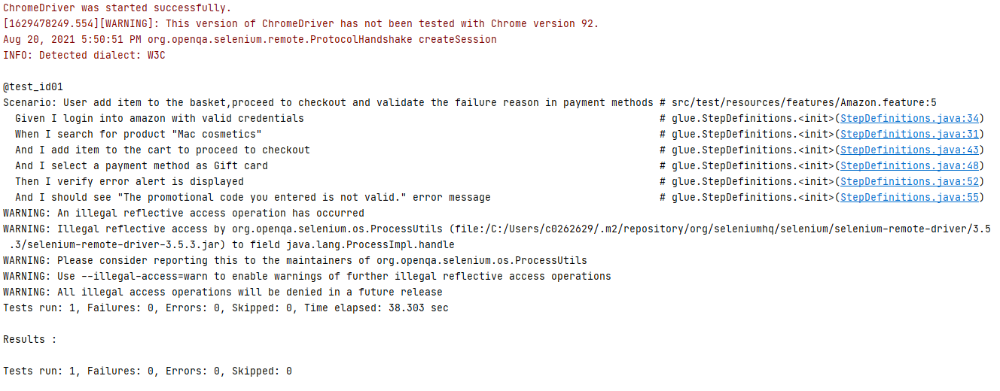
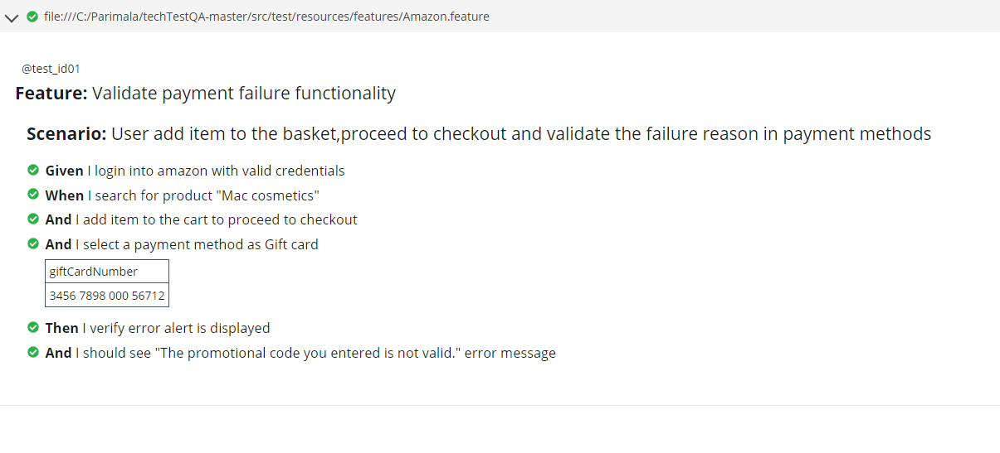

**Test Automation using Selenium, Cucumber, JUnit, Maven, and Java Language with Page Object Model**

**Tools used :**
1. Java Development Kit (JDK)
2. Selenium WebDriver
3. Cucumber and Gherkins
4. JUnit
5. Maven
6. ChromeDriver
7. Intellij IDEA

**How to Execute?**
Run your test using mvn clean install or run the TestRunner class.

`**Test Result:**`
See the result inside target/cucumber-reports/advanced-reports/cucumber-html-reports or target/cucumber-reports/cucumber-pretty folders that automatically generated after finished the test execution
Open html file in your browser
Or you can create your result view using json file inside target/cucumber-reports

`
**Components of the framework:**`
Page Object Design Pattern with Selenium PageFactory in Cucumber
• Page Objects Manager
• Read Configurations from Property File
• File Reader Manager
• Web Driver Manager
• Use of Tags
• Developing as a Maven Project
• State context sharing between different step definition files and different scenarios
• Cucumber Reports

`**I. Page Object Design Pattern with Selenium PageFactory in Cucumber**`
The main advantage of Page Object Model is that if the UI or any HTML 
object changes for any page, the test does not need any fix. Only the code within the page objects will be changed, but it does not have any impact to the test.
If we consider the project where we have huge number of tests with step definitions , it becomes unmanageable and unmaintainable. To better manage the code and 
to improve the re-usability, this pattern suggests us to divide an application in different pages or a single page in to sub-pages. The Page Object Pattern technique
provides a solution for working with multiple web pages and prevents unwanted code duplication and enables an uncomplicated solution for code maintenance. 
In general, every page in our application will be represented by a unique class of its own, and the page element inspection will be implemented in every class. 
Page Factory is an inbuilt Page Object Model concept for Selenium WebDriver, and it is more optimized. PageFactory is used to Initialize Elements of a Page class without 
having to use ‘FindElement‘ or ‘FindElements‘. As the name suggest, it helps to find the elements in the page using By strategy. @FindBy can accept TagName, PartialLinkText, 
Name, LinkText, Id, Css, ClassName, XPath as attributes. An alternative mechanism for locating the element or a list of elements. This allows users to quickly and easily create PageObjects.

@FindBy(how = How.CSS, using = “.username“)]
private WebElement userName;
The above code will create a PageObject and name it as UserName by finding it using its CSS locator.

InitElements
This instantiates an Instance of the given class. This method will attempt to instantiate the class given to it, preferably using a constructor which takes a WebDriver instance as its only argument or falling back on a no-arg constructor. An exception will be thrown if the class cannot be instantiated.
PageFactory.initElements(WebDriver, PageObject.Class);

Parameters:

• WebDriver – The driver that will be used to look up the elements
• PageObjects – A class which will be initialized

`**II.Page Object Manager**`
In the case of multiple step definition files, we will be creating object of Pages again and again which is against the coding principle. To avoid this situation, we can create a Page Object Manager. Purpose of the Page Object Manager is to create the page’s object and also to make sure that the same object should not be created again and again.

`**III.Read Configurations from Property File**`
It is dangerous to store hard coded and confidential values in the project, also it is against the coding principles. With the help of properties file, we can eliminate these hard coded values in the project.

`**IV.Design WebDriver** `
WebDriver Manager is used to create the driver instance only in one place and call it all in our tests as and then needed.

`**V.Use of Tags**`
Cucumber provides a way to organize your scenario execution by using tags in feature file. We can define each scenario with a useful tag.
In the runner file, we can decide which specific tag (and so as the scenario(s)) we want Cucumber to execute.

`**VI.Sharing Test Context between Cucumber Step Definitions**`
A scenario in Cucumber is a series of steps which gets executed one after one. Each step in scenario may have some state which can be required by other step in the scenario. In other way you can also say that each step depends on previous steps. This means that we must be able to share state between steps.
Also, when your test steps or feature files grows, Keeping all the steps in a single Step Definition class quickly becomes impractical, so you use many classes. Now you have a new problem – objects you create in one step class will be needed in the other step classes as well.
SO we have to share the Test Context / Scenario Context / Test State with all the Step Definitions file. This is why Cucumber supports several Dependency Injection (DI) Containers – it simply tells a DI container to instantiate your step definition classes and wire them up correctly. One of the supported DI 
containers is PicoContainer.

`**VII.Reports**`
_Console Output which is more readable_

_HTML Report which gives clear details on each and every step of scenario_

`**Further improvements or enhancements needed:**`
1. Extent Report
2. Adding screenshot for the test failure and after each and every step ( as evidence)
3. Test execution in multiple browsers 

